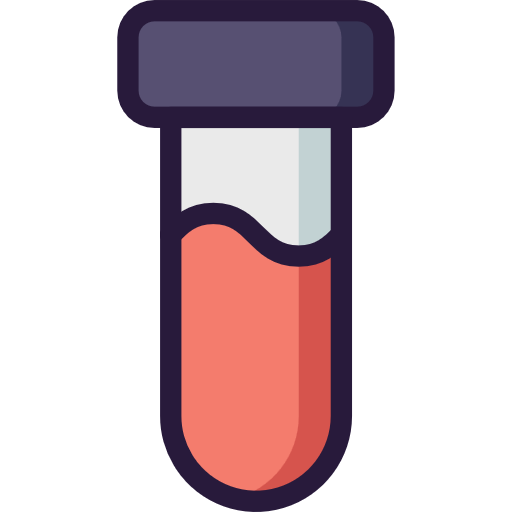

# cac-elrocho 🩺 `v0.9.4`



> **Cuadro de gestión de analíticas clínicas autónomo y autoalojable con extracción automatizada por Inteligencia Artificial (LLM)**

> **Tus datos clínicos, bajo tu control**
>
> Aplicación de escritorio gratuita y de código abierto que permite organizar, consultar y visualizar la evolución de tus analíticas.
>
> Opcionalmente, utiliza inteligencia artificial de Google Gemini para interpretar los documentos PDF y extraer automáticamente los parámetros analíticos.
>
> La información obtenida se almacena localmente en tu ordenador, sin necesidad de crear una cuenta ni utilizar un servicio de almacenamiento en la nube.

> [!IMPORTANT]
> Para utilizar las funciones de inteligencia artificial, únicamente necesitas configurar tu propia clave API de Google Gemini. Los documentos enviados a Gemini están sujetos a las condiciones de tratamiento de datos de Google, que pueden variar según se utilice la modalidad gratuita o de pago de su API.

`cac-elrocho` es una aplicación web integral y soberana diseñada para la digitalización, seguimiento evolutivo y supervisión longitudinal de analíticas médicas y controles de laboratorio. 

Su principal ventaja diferencial radica en la **automatización total de la ingesta de datos**: la aplicación lee, extrae e incorpora los parámetros analíticos directamente desde los archivos PDF emitidos por cualquier laboratorio clínico (Megalab, Recoletas, Quirónsalud, Synlab, laboratorios hospitalarios públicos o privados). Este proceso se realiza de manera totalmente automática —asistido opcionalmente por modelos de **Inteligencia Artificial (LLM)** o mediante un motor de extracción local inteligente—, reduciendo al máximo la necesidad de realizar transcripciones o tareas manuales.

Diseñada para ser ejecutada de manera autónoma y multiplataforma mediante **Docker** (en **Windows**, **Linux** o **macOS**), la aplicación almacena el historial médico en una base de datos local SQLite (WAL), calcula ratios aterogénicos y metabólicos automáticos, audita cambios en rangos de referencia y emite valoraciones clínicas con gráficos evolutivos interactivos.

---

## ✨ Novedades de la Versión `v0.9.4`
* 🩹 **Actualización Docker segura**: la aplicación migra automáticamente las columnas nuevas de las bases SQLite existentes, sin borrar ni recrear datos clínicos durante una actualización.
* 🖼️ **Recursos de marca en Docker**: el logotipo y los demás recursos visuales se incluyen correctamente en la imagen de contenedor.
* ⚙️ **Configuración de IA con tres niveles**: La aplicación permite definir desde su interfaz los slots principal, de respaldo y de razonamiento, con conmutación automática 1 → 2 → 3. Las claves no se incluyen en la base de datos ni en las copias de seguridad.
* 🪟 **Instalador para Windows disponible**: cada release publica el archivo `cac-elrocho-vX.Y.Z.exe` listo para instalar en Windows 10/11 de 64 bits. La instalación no requiere Docker ni una cuenta y conserva los datos clínicos, PDFs, copias de seguridad y configuración en el perfil local del usuario, fuera de la carpeta del programa.
* 🎨 **Identidad visual renovada**: Nuevo logotipo integrado en la interfaz y en la documentación.
* ✅ **Distribución verificada**: La integración continua comprueba las pruebas, los estilos generados y el empaquetado de escritorio antes de publicar.
* 📋 *Consulta el historial completo de cambios en [CHANGELOG.md](CHANGELOG.md).*

---

## 🚀 Características Principales

* 📄 **Extracción Automatizada de PDFs (Sin transcripción manual)**:
  * Lee, extrae y normaliza de forma automática todos los datos directamente de los informes clínicos en PDF de cualquier laboratorio médico (público o privado).
  * Reduce a cero el trabajo manual de mecanografiado: captura analitos, valores numéricos, unidades, rangos de referencia, laboratorios y médicos solicitantes.
  * Modalidad híbrida y soberana: asistida opcionalmente por modelos LLM multimodales (**Google Gemini API**) o ejecutada de forma local e inmediata con el motor por patrones RegEx (sin necesidad de IA ni conexión externa).
  * Cuando se configura Gemini, la aplicación aprovecha su lectura multimodal nativa de PDF para interpretar directamente la estructura, las tablas y el contenido de los informes clínicos.
  * Supervisión *Human-in-the-Loop*: ventana modal de previsualización para validar o ajustar datos en segundos antes de incorporarlos a la base de datos.
* 📊 **Panel de Control Integral**: Tarjetas KPI, 8 gráficos evolutivos interactivos con Chart.js y tabla de resultados completa con promedio reciente a 18 meses.
* 👤 **Ficha Personal del Paciente**:
  * Configuración soberana y privada de datos personales: **Nombre**, **Documento de Identidad (DNI/NIE)**, **Fecha de Nacimiento** (con cálculo dinámico de edad cumplida) y **Sexo** (Masculino / Femenino / No especificado).
  * Los datos de configuración son privados y nunca son sobreescritos por los informes médicos que se suban.
* 🤖 **Copiloto Clínico con IA y Auditoría de Rangos (Gemini API)**:
  * **Auditoría de Rangos de Referencia**: Detecta si un laboratorio ha actualizado sus límites de normalidad (por ejemplo, el dintel de LDL de 130 a 116 mg/dL según guías SEA 2023) y explica el motivo clínico.
  * Detección de prediabetes (HbA1c ≥ 5.7%) y semaforización clínica rigurosa.
* 🛡️ **Detección y Control de Analíticas Duplicadas**:
  * Verificación criptográfica por hash **SHA-256** de los archivos PDF subidos y comprobación de colisión por fecha/laboratorio.
  * Banner informativo y selector de acción inteligente: opción de **sobrescribir/actualizar** el informe existente o guardarlo como nueva analítica independiente.
* 🛡️ **Validación de Identidad Flexible (Human-in-the-Loop)**:
  * Comprobación tolerante de identidad entre el informe PDF y el paciente configurado (ignora orden de apellidos/nombre, tildes, mayúsculas y ceros a la izquierda en el DNI).
  * En caso de discrepancia real (por ejemplo, si se sube por error el informe de otra persona), emite una advertencia previa no bloqueante en el modal de revisión.
* 🔐 **Panel de Gestión y Respaldo de Datos**:
  * **Exportación con Marca Temporal**: Descarga copias de seguridad completas en JSON con fecha y hora (`cac-elrocho-backup-YYYYMMDD_HHMMSS.json`) y soporte para **cifrado simétrico AES-256-GCM**.
  * **Importación y Restauración Completa**: Restaura copias de seguridad (planas o cifradas) con sustitución limpia y sin duplicidades.
  * **Purga y Modo Demo**: Posibilidad de vaciar la base de datos para empezar de cero o cargar datos sintéticos de prueba.
* 📁 **Buzón Desatendido (`/inbox`)**: Monitor de carpetas en segundo plano para procesar PDFs subidos vía SFTP, Samba o Nextcloud.
* 🔒 **Privacidad Total**: Documentos originales, bases de datos SQLite y claves de API estrictamente excluidos del control de versiones (`.gitignore`).
* 🤖 **CI/CD y Mantenimiento Automatizado**: Integración continua con **GitHub Actions**, publicación en **GitHub Container Registry (GHCR)** y soporte nativo para **Dependabot**.

---

## 🛠️ Requisitos del Sistema

* **Sistema Operativo**:
  * **Windows**: Windows 10/11 de 64 bits. Se recomienda el instalador de la [última versión publicada](https://github.com/el-rocho/cac-elrocho/releases/latest); Docker Desktop sigue disponible como alternativa para ejecutar el servicio en contenedor.
  * **Linux**: Debian 13 (Trixie), Ubuntu 22.04+ o cualquier distribución Linux con Docker.
  * **macOS**: Docker Desktop para macOS.
* **Recursos Mínimos**:
  * 1 vCPU / Procesador estándar
  * 1 GB de memoria RAM
  * 10 GB de almacenamiento disponible
* **Software**: Docker y Docker Compose (`docker compose`).

---

## 📦 Instalación y Despliegue con Docker Compose

### 1. Clonar el Repositorio
```bash
git clone https://github.com/el-rocho/cac-elrocho.git
cd cac-elrocho
```

### 2. Preparar la configuración de despliegue
Copia la plantilla de configuración. El archivo `.env` se conserva para los parámetros operativos de Docker y de la aplicación, pero **no contiene configuración ni claves de LLM**:
```bash
# En Linux / macOS:
cp .env.example .env

# En Windows (PowerShell / CMD):
copy .env.example .env
```
Edita el archivo `.env` con tu editor preferido (`nano .env`, Bloc de notas, VS Code, etc.) solo si necesitas cambiar parámetros operativos. La configuración predeterminada ya establece la raíz de datos correcta para Docker:
```ini
# Raíz única de todos los datos persistentes. En desarrollo desde este
# repositorio puede omitirse; en Docker debe ser /app.
APP_DATA_DIR=/app
```

### 3. Configurar los modelos LLM desde la aplicación

Después de iniciar la aplicación, abre **⚙️ Configuración y Datos → Inteligencia Artificial**. En una instalación nueva, los tres slots aparecen desactivados y con **Sin IA** como proveedor: el usuario decide si configura alguno. La aplicación está preparada actualmente para modelos de **Google Gemini** y permite configurar hasta tres slots, en este orden:

| Slot | Uso recomendado | Comportamiento |
| --- | --- | --- |
| 1. Principal | Modelo rápido y preciso | Se intenta primero. |
| 2. Respaldo | Modelo alternativo con otra cuota o menor latencia | Se usa si falla el slot 1. |
| 3. Razonamiento avanzado | Modelo de mayor capacidad | Se usa si fallan los anteriores. |

En cada slot puedes activar o desactivar Gemini, indicar el identificador de modelo, actualizar su clave y comprobar la conexión. La conmutación ocurre automáticamente en el orden **1 → 2 → 3**. Si no existe una clave válida, los modelos fallan o no hay conexión a internet, la aplicación utiliza el extractor local basado en expresiones regulares sin interrumpir el servicio.

Los modelos, su orden y su estado se guardan en `APP_DATA_DIR/config/config.json`. Las claves se guardan por separado para cada slot:

* En Windows, en el almacén de credenciales del sistema operativo.
* En Docker, en `APP_DATA_DIR/config/llm-credentials.json`, con permisos `0600` dentro del volumen persistente `./config`.

Las claves nunca se copian a SQLite, `.env`, las respuestas de la API ni las copias de seguridad de la aplicación. Si el sistema local no dispone de un almacén de credenciales operativo, la aplicación usa el mismo fichero de credenciales separado como respaldo. Si una instalación anterior tenía claves LLM en `.env`, introdúcelas desde la interfaz y elimínalas manualmente de ese archivo.

### 4. Levantar los Contenedores
Descarga la imagen precompilada en GitHub Actions y levanta el servicio sin consumir recursos de compilación en tu máquina:
```bash
docker compose pull
docker compose up -d
```
*(Nota: Si deseas compilar localmente desde el código fuente en lugar de usar la imagen precompilada, puedes usar `docker compose up -d --build`).*

Accede desde tu navegador a:
```
http://localhost:8000            # Si lo ejecutas en tu propio equipo (Windows, macOS o Linux)
http://IP_DE_TU_SERVIDOR:8000    # Si lo ejecutas en un servidor remoto o máquina virtual
```

---

## 🔄 Actualización Rápida en el Servidor (Sin Compilar)

Con el flujo de **GitHub Actions** configurado, cada versión etiquetada (`v0.9.0`) y cambio en `main` genera automáticamente la imagen en **GitHub Container Registry (GHCR)**. Para actualizar tu servidor en segundos:

```bash
cd cac-elrocho
git pull
docker compose pull
docker compose up -d
docker image prune -f
```

> [!NOTE]
> **Autenticación en GHCR (solo si el paquete es privado)**:
> Si el paquete en GitHub Packages es privado, solo necesitas autenticarte una vez en el servidor con un Personal Access Token (PAT con permiso `read:packages`):
> ```bash
> echo "TU_GITHUB_PAT" | docker login ghcr.io -u TU_USUARIO_GITHUB --password-stdin
> ```
> Si el paquete está configurado como **Público** (*Package settings > Danger Zone > Change package visibility*), no se requiere ninguna autenticación.

---

## ⚙️ Primeros Pasos y Configuración

1. Dirígete a la pestaña **⚙️ 5. Configuración y Datos** en la barra superior.
2. En la sección **Datos Personales del Paciente**, introduce tu Nombre, DNI, Fecha de Nacimiento y Sexo y pulsa en `Guardar Datos del Paciente`.
3. Ahora puedes:
   * **Subir tus analíticas**: Pulsa en el botón azul de la cabecera `➕ Subir Nueva Analítica (PDF)` o arrastra archivos.
   * **O restaurar una copia previa**: En la pestaña de configuración, selecciona tu archivo `.json` de respaldo y pulsa en `Restaurar Respaldo`.
   * **Explorar con datos demo**: Si deseas probar las gráficas antes de cargar tus análisis reales, pulsa en `Restablecer Datos de Demostración (Demo)`.

---

## 🌐 Configuración HTTPS Automática con Caddy (Opcional)

Si deseas exponer la aplicación en un servidor público o dominio con certificado SSL/HTTPS Let's Encrypt automático:

1. Descomenta el servicio `caddy` en `docker-compose.yml`.
2. Crea un archivo `Caddyfile` en la raíz del proyecto:
```caddy
tudominio.com {
    reverse_proxy app:8000
}
```
3. Reinicia los contenedores con `docker compose up -d`.

---

## 💻 Desarrollo y Ejecución Local (sin Docker)

Si prefieres ejecutar la aplicación de forma nativa con Python:

### En Windows:
**Opción A (Símbolo del sistema / CMD):**
```cmd
copy dev.bat.example dev.bat
.\dev.bat
```

**Opción B (PowerShell):**
```powershell
Copy-Item run_dev.ps1.example run_dev.ps1
.\run_dev.ps1
```
*(El script creará automáticamente el entorno virtual, instalará las dependencias si no existen y arrancará el servidor en http://localhost:8000).*

### En Linux / macOS:
```bash
# 1. Crear entorno virtual
python3 -m venv venv
source venv/bin/activate

# 2. Instalar dependencias
pip install -r requirements.txt

# 3. Iniciar servidor de desarrollo
uvicorn app.main:app --reload --port 8000
```

---

## 🪟 Aplicación de escritorio para Windows

Descarga `cac-elrocho-vX.Y.Z.exe` desde la [última versión publicada](https://github.com/el-rocho/cac-elrocho/releases/latest) y ejecútalo en Windows 10/11 de 64 bits. No requiere Docker ni cuenta de usuario. El instalador crea los accesos directos opcionales y no elimina tus datos clínicos al desinstalar; estos se mantienen en `%LOCALAPPDATA%\AnaliticasClinicas`. Como precaución habitual, crea una copia de seguridad desde la aplicación antes de actualizar o desinstalar.

---

## 📄 Licencia y Aviso Médico
Desarrollado para la gestión y seguimiento personal de salud. Los dictámenes y avisos generados por el LLM tienen carácter exclusivamente informativo y de apoyo, y no sustituyen el criterio de un médico especialista colegiado.

